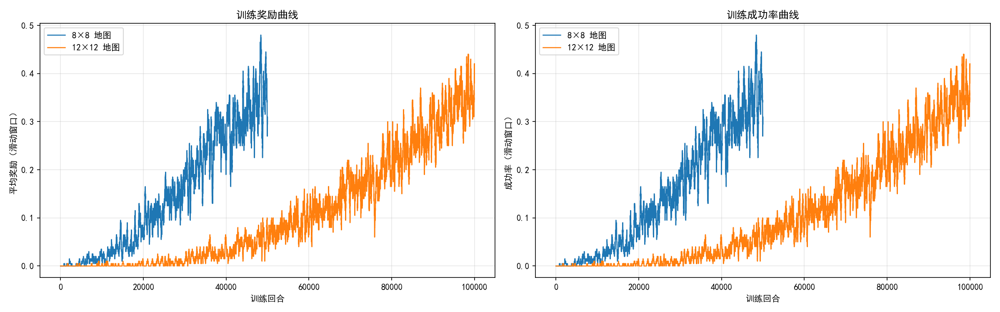
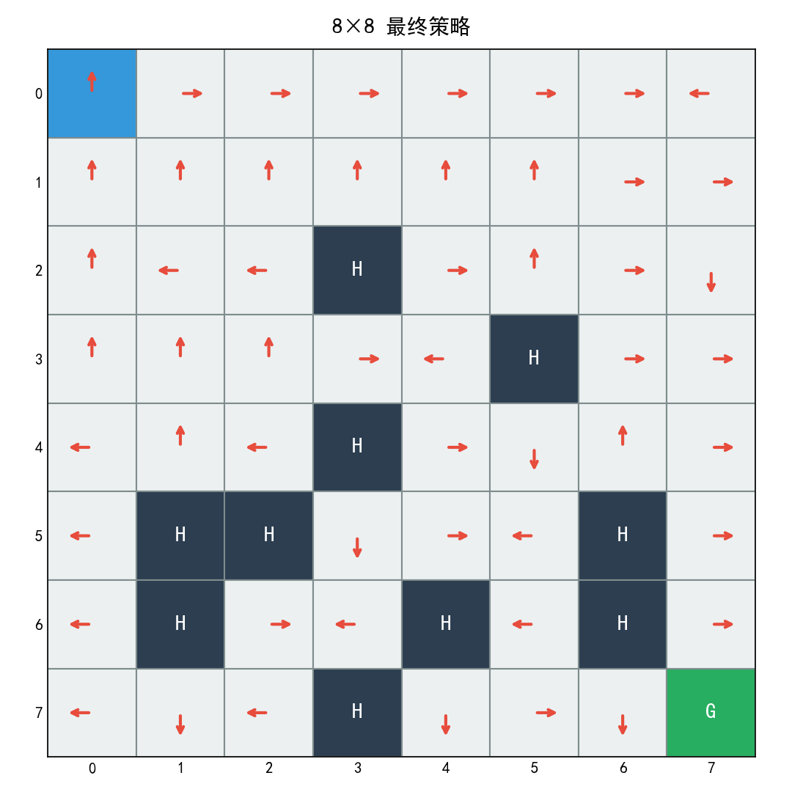
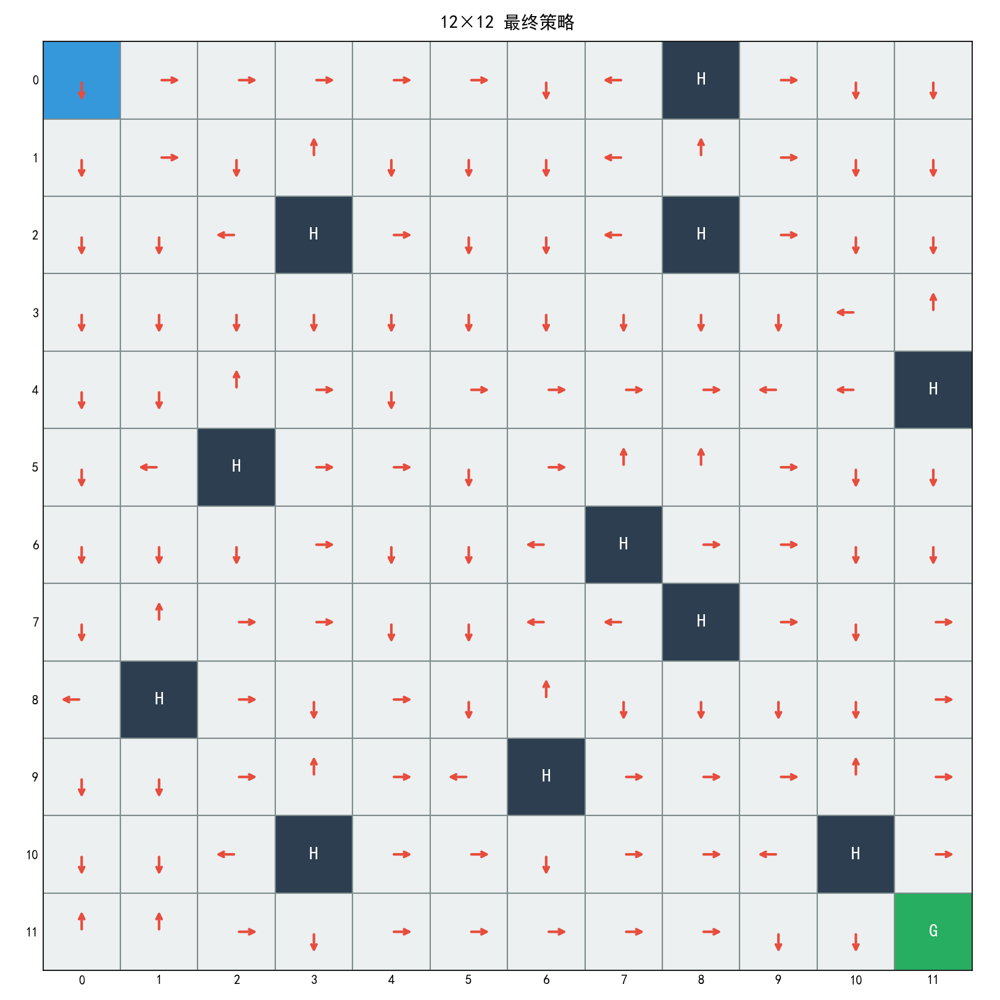
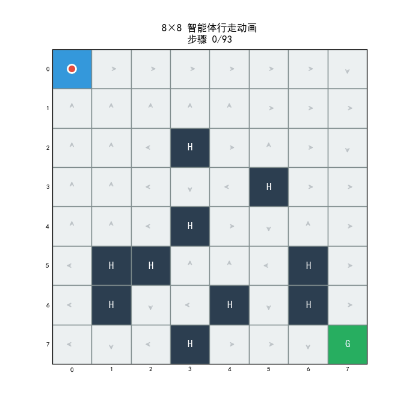
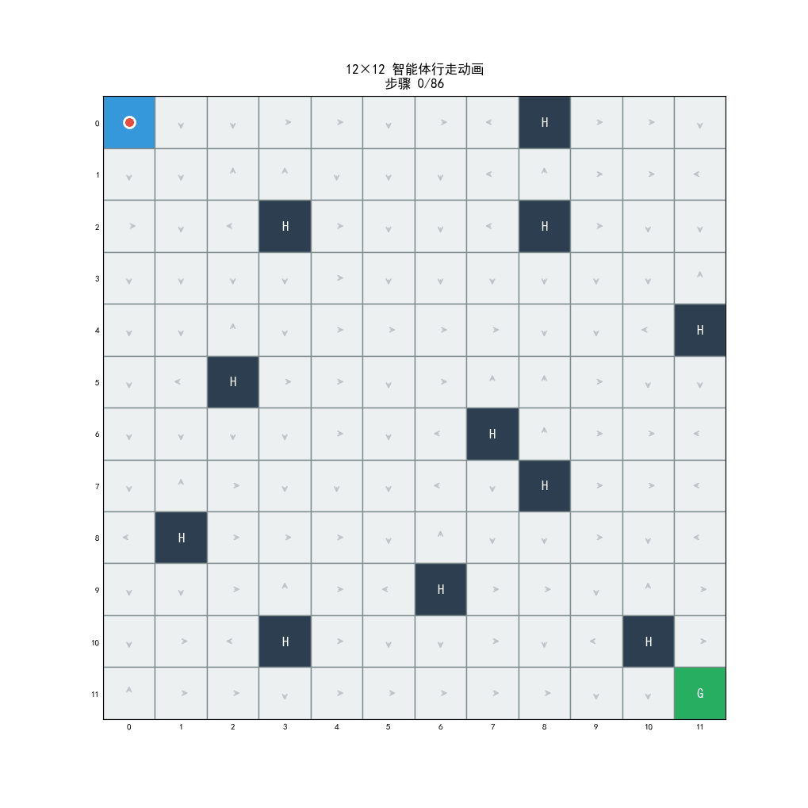

# 实验报告

## 一、实验题目

基于随机滑动 FrozenLake 的 Q-learning 求解实验

## 二、实验目的

1. 理解 Gymnasium 中 FrozenLake 环境的状态、动作、奖励与终止机制。
2. 掌握表格型 Q-learning 的基本实现方法。
3. 观察在随机滑动条件下，探索机制对学习效果的影响。
4. 比较在 8×8 预设地图与自定义 12×12 地图上，Q-learning 的训练难度与最终表现差异。

## 三、实验环境

- **操作系统**：Windows 11
- **Python 版本**：Python 3.10（conda 环境 `rl_course`）
- **核心依赖**：Gymnasium 1.2.3、NumPy 2.2.6、Matplotlib 3.10.8、Pillow

## 四、环境描述

### 4.1 FrozenLake-v1 环境

FrozenLake-v1 是 Gymnasium Toy Text 中的经典离散网格世界环境。智能体在一个冰冻湖面上移动，目标是从起点 **S** 到达终点 **G**，同时避免掉入冰洞 **H**。

- **状态空间**：离散，状态数 = 行数 × 列数（8×8 = 64 个状态，12×12 = 144 个状态）
- **动作空间**：离散 4 个动作 — 0（左）、1（下）、2（右）、3（上）
- **奖励机制**：到达终点 G 获得奖励 1.0，其余情况奖励为 0.0
- **终止条件**：到达 G（成功）或掉入 H（失败），或超过最大步数（截断）

### 4.2 随机滑动机制

本实验中所有环境均设置 `is_slippery=True`。在该模式下，智能体执行动作时不一定沿期望方向移动：

- 以 **1/3** 的概率朝期望方向移动
- 以 **1/3** 的概率朝顺时针垂直方向移动
- 以 **1/3** 的概率朝逆时针垂直方向移动

这使得环境具有很强的随机性，即便学到最优策略，成功率也无法达到 100%（尤其在陷阱密集的地图上）。

### 4.3 地图配置

**8×8 预设地图**（Gymnasium 内置）：

```
SFFFFFFF
FFFFFFFF
FFFHFFFF
FFFFFHFF
FFFHFFFF
FHHFFFHF
FHFFHFHF
FFFHFFFG
```

**12×12 自定义地图**：

```
SFFFFFFFHFFF
FFFFFFFFFFFF
FFFHFFFFHFFF
FFFFFFFFFFFF
FFFFFFFFFFFH
FFHFFFFFFFFF
FFFFFFFHFFFF
FFFFFFFFHFFF
FHFFFFFFFFFF
FFFFFFHFFFFF
FFFHFFFFFFHF
FFFFFFFFFFFG
```

8×8 地图共有 6 个冰洞，分布较为密集，多条路径被阻断；12×12 地图共有 11 个冰洞，但由于地图面积更大（144 格 vs 64 格），陷阱密度反而更低，通行路径更多。

## 五、算法原理

### 5.1 Q-learning 算法

Q-learning 是一种无模型（model-free）的离策略（off-policy）时序差分（TD）强化学习算法。其核心思想是维护一个 Q 表 $Q(s,a)$，记录在状态 $s$ 下执行动作 $a$ 的期望累积回报。

**核心更新公式**：

$$Q(s,a) \leftarrow Q(s,a) + \alpha \left[ R + \gamma \max_{a'} Q(s',a') - Q(s,a) \right]$$

其中：
- $\alpha$ 为学习率，控制新信息的接受程度
- $\gamma$ 为折扣因子，衡量未来奖励的重要性
- $R$ 为即时奖励
- $\max_{a'} Q(s',a')$ 为下一状态的最优 Q 值估计

### 5.2 epsilon-greedy 探索策略

为平衡探索（exploration）与利用（exploitation），采用 $\varepsilon$-greedy 策略：

- 以概率 $\varepsilon$ 随机选择动作（探索）
- 以概率 $1 - \varepsilon$ 选择当前 Q 值最大的动作（利用）

$\varepsilon$ 随训练进行按指数衰减：$\varepsilon \leftarrow \max(\varepsilon_{\min}, \varepsilon \times \varepsilon_{\text{decay}})$

## 六、核心代码实现

### 6.1 Q-learning 智能体

```python
class QLearningAgent:
    def __init__(self, n_states, n_actions, alpha=0.1, gamma=0.99,
                 epsilon=1.0, epsilon_min=0.01, epsilon_decay=0.9995,
                 q_init=0.0):
        self.q_table = np.full((n_states, n_actions), q_init, dtype=float)
        # ... 参数赋值

    def choose_action(self, state):
        """epsilon-greedy 动作选择"""
        if np.random.random() < self.epsilon:
            return np.random.randint(self.n_actions)
        return int(np.argmax(self.q_table[state]))

    def update(self, state, action, reward, next_state, done):
        """Q-learning 更新"""
        td_target = reward + self.gamma * np.max(self.q_table[next_state]) * (1 - done)
        td_error = td_target - self.q_table[state, action]
        self.q_table[state, action] += self.alpha * td_error
```

### 6.2 训练过程

```python
def train(env, agent, n_episodes, log_interval=2000):
    for ep in range(n_episodes):
        state, _ = env.reset()
        done = False
        while not done:
            action = agent.choose_action(state)
            next_state, reward, terminated, truncated, _ = env.step(action)
            done = terminated or truncated
            agent.update(state, action, reward, next_state, float(terminated))
            state = next_state
        agent.decay_epsilon()
```

### 6.3 测试过程

```python
def test(env, agent, n_episodes=1000):
    for _ in range(n_episodes):
        state, _ = env.reset()
        done = False
        while not done:
            action = int(np.argmax(agent.q_table[state]))  # 纯贪婪
            next_state, reward, terminated, truncated, _ = env.step(action)
            done = terminated or truncated
            state = next_state
```

## 七、实验参数

| 参数 | 8×8 地图 | 12×12 地图 |
|------|---------|-----------|
| 学习率 $\alpha$ | 0.15 | 0.15 | 控制每次更新幅度 |
| 折扣因子 $\gamma$ | 0.99 | 0.99 | 重视长远回报 |
| 初始探索率 $\varepsilon$ | 1.0 | 1.0 | 初始完全随机探索 |
| 最小探索率 $\varepsilon_{\min}$ | 0.02 | 0.02 | 保留少量探索 |
| 探索衰减 $\varepsilon_{\text{decay}}$ | 0.99995 | 0.99998 | 12×12 衰减更慢 |
| Q 表初始值 | 1.0 | 1.0 | 乐观初始化 |
| 训练回合数 | 50,000 | 100,000 | 大地图需更多训练 |
| 最大步数/回合 | 200（默认）| 500 | 大地图需更多步 |

**参数选择说明**：

- $\varepsilon_{\text{decay}}$ 选择了比常规建议值（0.995~0.9995）更慢的衰减速率。原因是在 `is_slippery=True` 的大地图上，智能体需要很长时间才能通过随机探索首次到达终点。如果 $\varepsilon$ 衰减太快，智能体在发现终点之前就停止了探索，导致 Q 表从未被正向奖励更新过，训练彻底失败（成功率 0%）。
- 12×12 地图的衰减速率比 8×8 更慢（0.99998 vs 0.99995），因为更大的状态空间需要更长的探索周期。
- `max_episode_steps` 为 12×12 地图设置为 500，因为从起点到终点的最短曼哈顿距离为 22 步，在随机滑动下实际路径远长于此，200 步的默认限制会导致大量回合被截断。

## 八、实验结果

### 8.1 训练过程

**8×8 地图训练日志（部分）**：

| 回合 | 平均奖励 | 成功率 | $\varepsilon$ |
|------|---------|--------|---------------|
| 2,000 | 0.002 | 0.15% | 0.9048 |
| 10,000 | 0.015 | 1.50% | 0.6065 |
| 20,000 | 0.072 | 7.20% | 0.3679 |
| 30,000 | 0.152 | 15.20% | 0.2231 |
| 40,000 | 0.267 | 26.70% | 0.1353 |
| 50,000 | 0.361 | 36.10% | 0.0821 |

**12×12 地图训练日志（部分）**：

| 回合 | 平均奖励 | 成功率 | $\varepsilon$ |
|------|---------|--------|---------------|
| 10,000 | 0.002 | 0.20% | 0.8187 |
| 30,000 | 0.007 | 0.75% | 0.5488 |
| 50,000 | 0.058 | 5.75% | 0.3679 |
| 70,000 | 0.164 | 16.35% | 0.2466 |
| 90,000 | 0.280 | 27.95% | 0.1653 |
| 100,000 | 0.367 | 36.70% | 0.1353 |

### 8.2 测试结果（贪婪策略，1000 回合）

| 指标 | 8×8 地图 | 12×12 地图 |
|------|---------|-----------|
| **平均奖励** | 0.569 | 1.000 |
| **成功率** | 56.90% | 100.00% |
| **平均步数** | 75.9 | 114.2 |

### 8.3 最终策略输出

**8×8 策略**（箭头表示每个状态的贪婪动作）：

```
 S↑  →   →   →   →   →   →   ← 
  ↑   ↑   ↑   ↑   ↑   ↑   →   → 
  ↑   ←   ←   H   →   ↑   →   ↓ 
  ↑   ↑   ↑   →   ←   H   →   → 
  ←   ↑   ←   H   →   ↓   ↑   → 
  ←   H   H   ↓   →   ←   H   → 
  ←   H   →   ←   H   ←   H   → 
  ←   ↓   ←   H   ↓   →   ↓   G 
```

**12×12 策略**：

```
 S↓  →   →   →   →   →   ↓   ←   H   →   ↓   ↓ 
  ↓   →   ↓   ↑   ↓   ↓   ↓   ←   ↑   →   ↓   ↓ 
  ↓   ↓   ←   H   →   ↓   ↓   ←   H   →   ↓   ↓ 
  ↓   ↓   ↓   ↓   ↓   ↓   ↓   ↓   ↓   ↓   ←   ↑ 
  ↓   ↓   ↑   →   ↓   →   →   →   →   ←   ←   H 
  ↓   ←   H   →   →   ↓   →   ↑   ↑   →   ↓   ↓ 
  ↓   ↓   ↓   →   ↓   ↓   ←   H   →   →   ↓   ↓ 
  ↓   ↑   →   →   ↓   ↓   ←   ←   H   →   ↓   → 
  ←   H   →   ↓   →   ↓   ↑   ↓   ↓   ↓   ↓   → 
  ↓   ↓   →   ↑   →   ←   H   →   →   →   ↑   → 
  ↓   ↓   ←   H   →   →   ↓   →   →   ←   H   → 
  ↑   ↑   →   ↓   →   →   →   →   →   ↓   ↓   G 
```

## 九、可视化结果

### 9.1 训练曲线

下图展示了两种地图在训练过程中的平均奖励和成功率变化趋势（滑动窗口 = 200）：



### 9.2 最终策略网格图

**8×8 策略网格图**：



**12×12 策略网格图**：



### 9.3 动态效果图

以下 GIF 动画展示了智能体使用训练后的贪婪策略在地图上从起点走到终点的完整过程：

**8×8 行走动画**：



**12×12 行走动画**：


